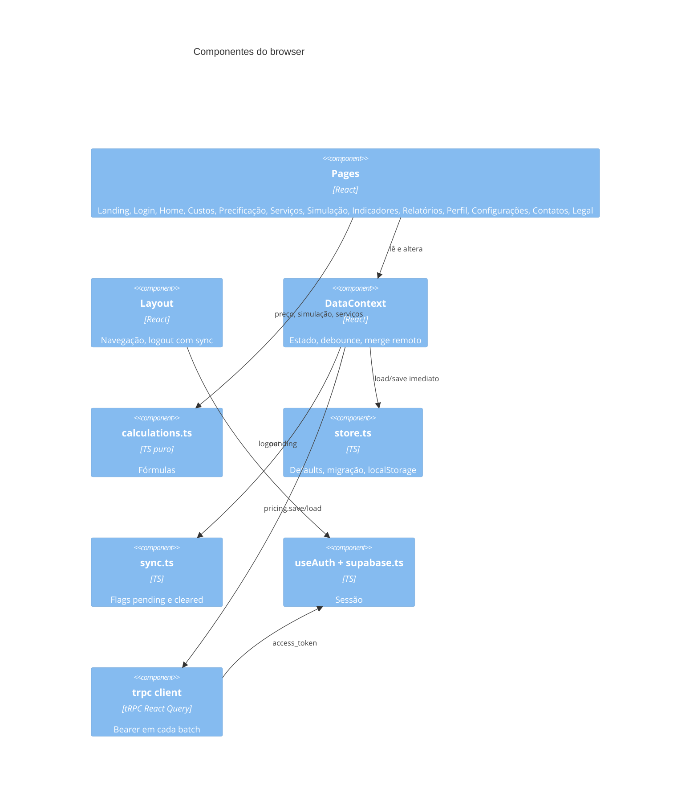
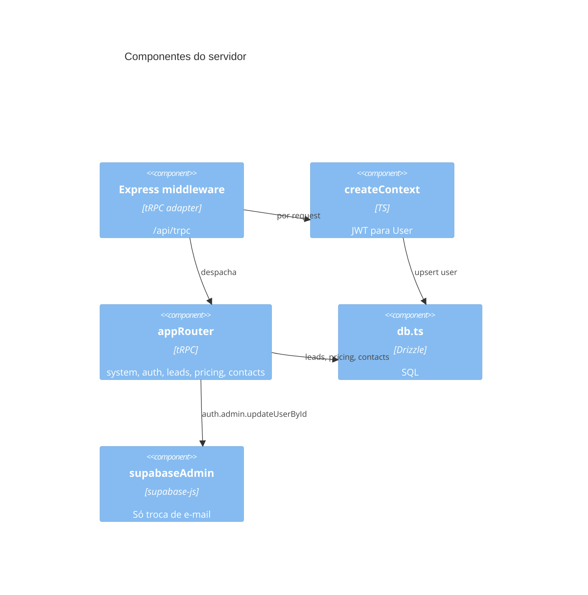

# C4 — Componentes

## SPA

```mermaid
C4Component
  title Componentes do browser

  Component(pages, "Pages", "React", "Landing, Login, Home, Custos, Precificação, Serviços, Simulação, Indicadores, Relatórios, Perfil, Configurações, Contatos, Legal")
  Component(layout, "Layout", "React", "Navegação, logout com sync")
  Component(data, "DataContext", "React", "Estado, debounce, merge remoto")
  Component(motor, "calculations.ts", "TS puro", "Fórmulas")
  Component(store, "store.ts", "TS", "Defaults, migração, localStorage")
  Component(sync, "sync.ts", "TS", "Flags pending e cleared")
  Component(auth, "useAuth + supabase.ts", "TS", "Sessão")
  Component(trpc, "trpc client", "tRPC React Query", "Bearer em cada batch")

  Rel(pages, data, "lê e altera")
  Rel(pages, motor, "preço, simulação, serviços")
  Rel(data, store, "load/save imediato")
  Rel(data, sync, "pending")
  Rel(data, trpc, "pricing.save/load")
  Rel(layout, auth, "logout")
  Rel(trpc, auth, "access_token")
```

## API

```mermaid
C4Component
  title Componentes do servidor

  Component(http, "Express middleware", "tRPC adapter", "/api/trpc")
  Component(ctx, "createContext", "TS", "JWT para User")
  Component(router, "appRouter", "tRPC", "system, auth, leads, pricing, contacts")
  Component(db, "db.ts", "Drizzle", "SQL")
  Component(admin, "supabaseAdmin", "supabase-js", "Só troca de e-mail")

  Rel(http, ctx, "por request")
  Rel(http, router, "despacha")
  Rel(ctx, db, "upsert user")
  Rel(router, db, "leads, pricing, contacts")
  Rel(router, admin, "auth.admin.updateUserById")
```

O motor **não** aparece no servidor. Isso é o corte principal do pacote. 🟢
