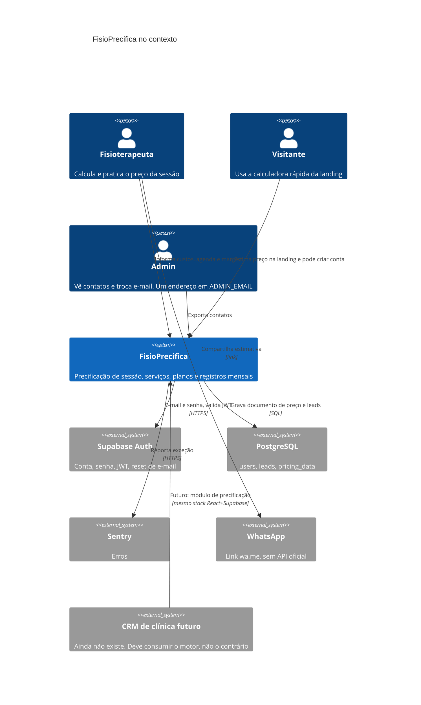

# C4 — Contexto

```mermaid
C4Context
  title FisioPrecifica no contexto

  Person(fisio, "Fisioterapeuta", "Calcula e pratica o preço da sessão")
  Person(visitante, "Visitante", "Usa a calculadora rápida da landing")
  Person(admin, "Admin", "Vê contatos e troca e-mail. Um endereço em ADMIN_EMAIL")

  System(app, "FisioPrecifica", "Precificação de sessão, serviços, planos e registros mensais")

  System_Ext(supabase, "Supabase Auth", "Conta, senha, JWT, reset de e-mail")
  System_Ext(postgres, "PostgreSQL", "users, leads, pricing_data")
  System_Ext(sentry, "Sentry", "Erros")
  System_Ext(whatsapp, "WhatsApp", "Link wa.me, sem API oficial")
  System_Ext(crm, "CRM de clínica futuro", "Ainda não existe. Deve consumir o motor, não o contrário")

  Rel(fisio, app, "Informa custos, agenda e margem")
  Rel(visitante, app, "Estima preço na landing e pode criar conta")
  Rel(admin, app, "Exporta contatos")
  Rel(app, supabase, "E-mail e senha, valida JWT", "HTTPS")
  Rel(app, postgres, "Grava documento de preço e leads", "SQL")
  Rel(app, sentry, "Reporta exceção", "HTTPS")
  Rel(fisio, whatsapp, "Compartilha estimativa", "link")
  Rel(crm, app, "Futuro: módulo de precificação", "mesmo stack React+Supabase")
```

Sistemas que aparecem no código e não estão no desenho acima de propósito: Manus Forge (`notifyOwner`, storage). Não participam do contexto de negócio do preço. 🟢
